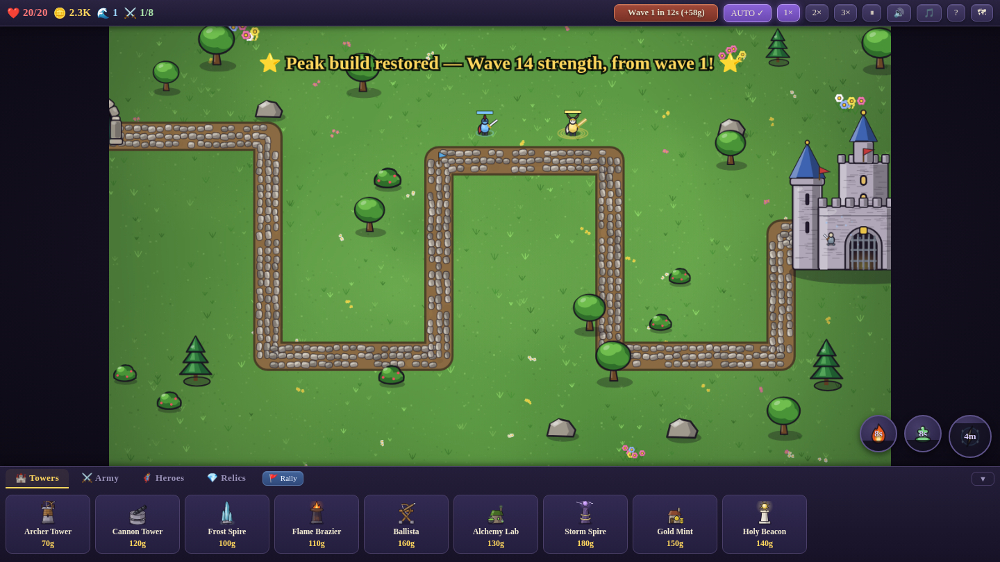

# 🏰 Castle Siege — Endless Defense

A medieval tower-defense game built for **playing while you multitask** — on desktop or phone.
Towers auto-fight, your army auto-resummons, heroes auto-cast their skills, waves auto-start.
You drop in between tasks to spend gold, cast a spell, and push one wave deeper.

## Play it

**On your computer** — download this `castle-siege` folder and double-click **`index.html`**.
No install, no server, fully offline.

**On your phone** — host the repo with GitHub Pages (Settings → Pages → deploy from branch →
`/` root), then open `https://<user>.github.io/<repo>/castle-siege/` in your phone's browser.
Play in landscape; use "Add to Home Screen" for fullscreen. Touch controls are built in
(tap a tile to preview a tower, tap again to build).

Progress autosaves every wave, per battlefield. Saves live in each browser's storage.

## The game

- **3 battlefields** — Easy (1 road), Medium (2 converging roads), Hard (3-path killzone,
  richer gold). Endless waves, a boss every 10th, Elite/Champion rarities.
- **9 towers × 5 levels**, **12 troop types** with discounted auto-resummon loadouts,
  **7 permanent relics**.
- **6 heroes** unlock as you push deeper — trainable, with signature skills (Lv 3) and
  passives (Lv 8).
- **3 spells**, free and self-recharging, on the buttons over the battlefield:
  **Firestorm** (click-target burn), **Sanctified Ground** (click-target heal zone), and
  **RAGNAROK** — a 5-minute-cooldown cataclysm that devastates every enemy, stuns the horde,
  resummons your whole army free, and empowers it. The last-minute clutch.

## ✨ Events, Legendaries & the Vault

- The **Gilded Boar** occasionally dashes across the field — kill it for bonus gold, free
  tower/troop upgrades, or instant spell resets.
- **Shadow Wardens** rarely appear dragging a captive legend. Slay one and a **Legendary
  Hero** joins you: *Aurelia the Dawnblade*, *Karrgoth the Wyrmborn*, or *Morrigan, Queen of
  Ravens* — far stronger than mortal heroes, with near-instant respawns.
- Legendaries are recorded in your **Vault** — permanent browser storage that survives every
  defeat and restart. Once freed, a legend is yours in every future run, free to summon.
- The Vault also tracks your **peak build** per battlefield: the **⭐ Peak button** on the
  map screen restarts at wave 1 with your best-ever hero levels, relics, troop levels, and a
  rebuild budget. Grind it once, keep it forever.

## Controls

| Desktop | Phone |
|---|---|
| Click tower card → click tile (Shift = several) | Tap card → tap tile → tap again to confirm |
| `1`–`9` build hotkeys, `H` heroes, `R` rally | Tap heroes/buttons directly |
| Click spell button → click target | Tap spell button → tap target |
| `Space` pause • `F` speed • `Esc` cancel | HUD buttons |

## Tech

Plain HTML5 canvas + JavaScript — no frameworks, no assets, no network calls. All art is
procedural (`sprites.js`), the medieval score is synthesized live with WebAudio (`music.js`),
and it installs as a PWA-style home-screen app via `manifest.json`.
